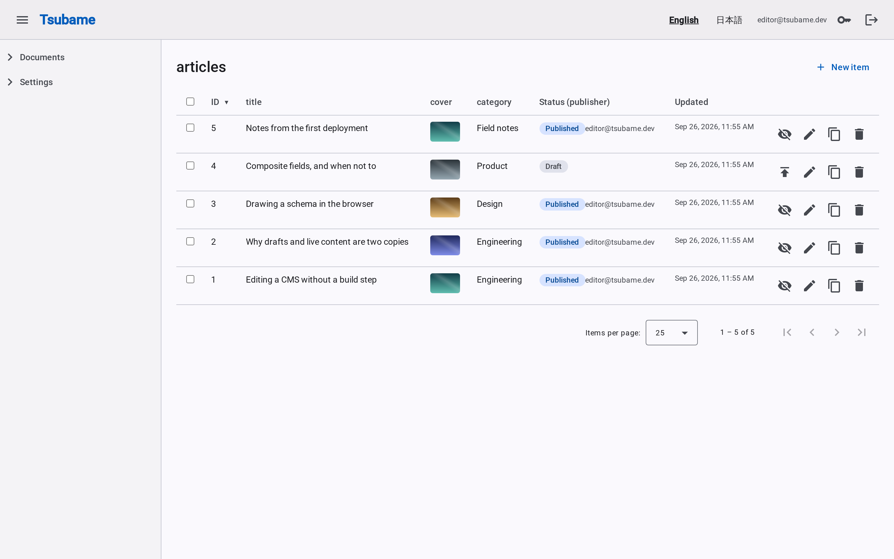
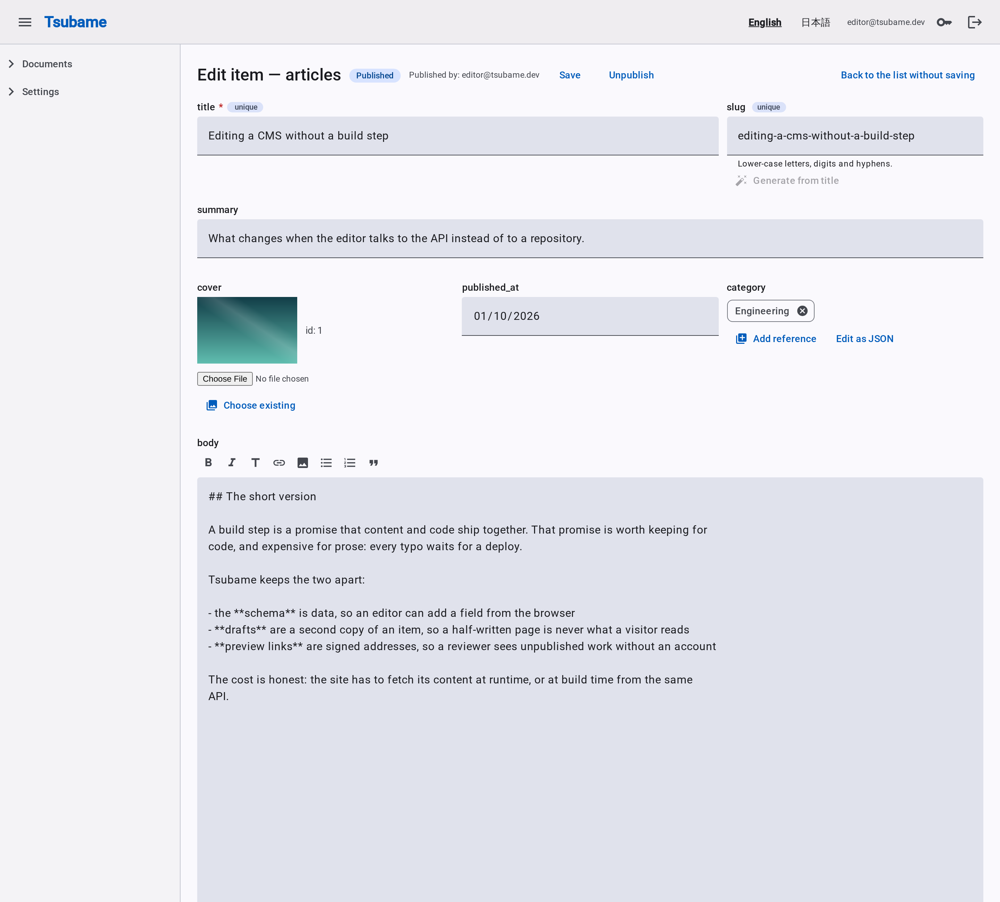
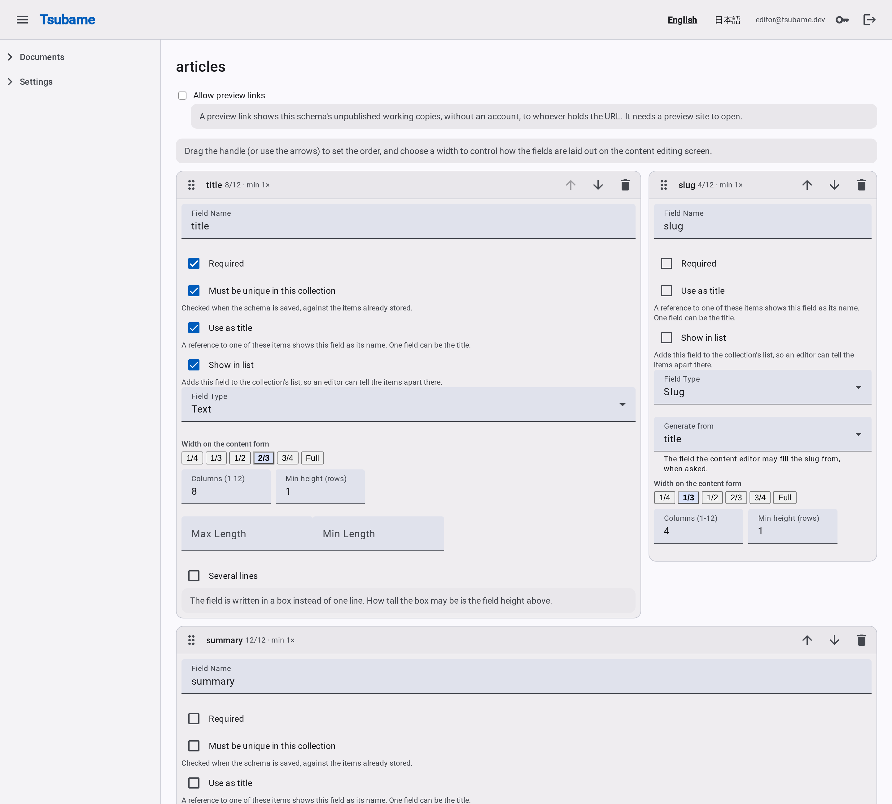
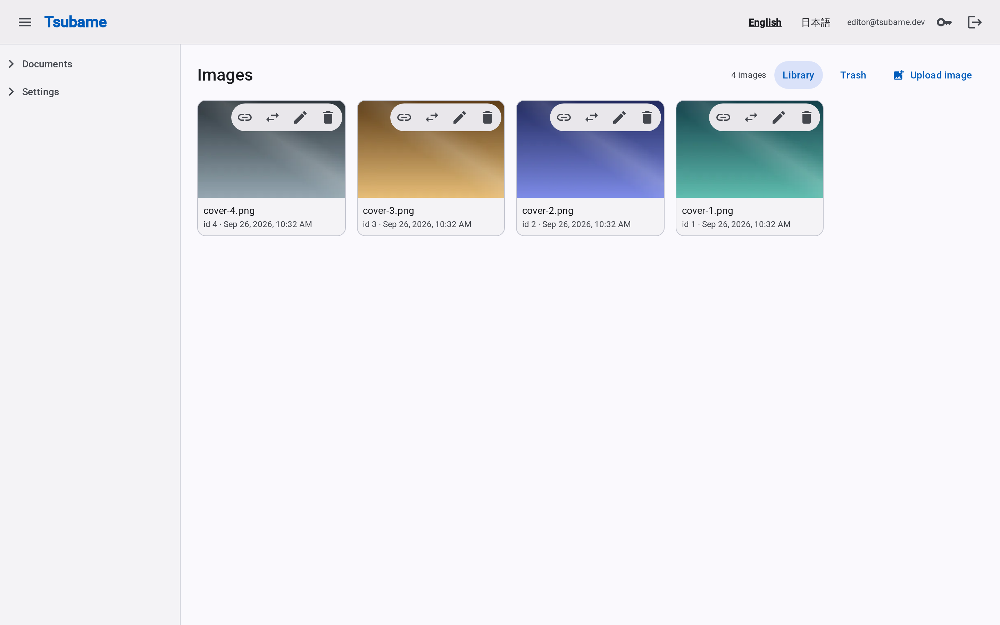
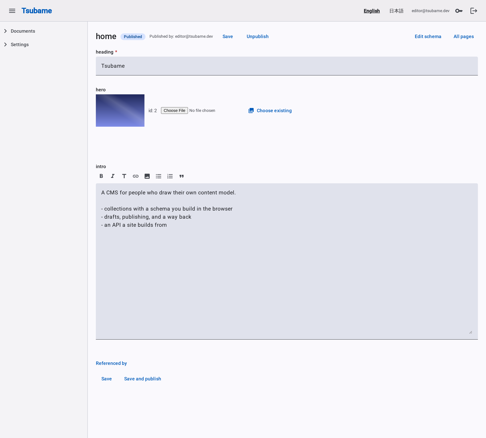
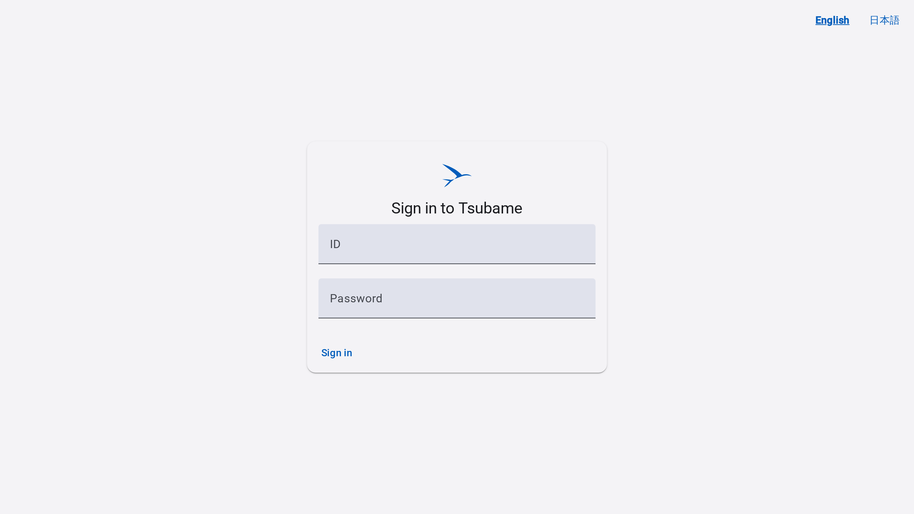

# Tsubame

[](https://github.com/cat-love-7/tsubame-cms/actions/workflows/ci.yml)
[](LICENSE)

A CMS that runs **serverless**: the API is a Lambda function, content lives in DynamoDB, images in
S3 and the admin app on CloudFront, so there is no server to keep, no database to size and nothing
billed while nobody is editing. A small site pays for what it uses - requests, storage, transfer -
rather than for uptime.

It is a CMS with a schema an editor draws and an API a site builds from: collections and single
pages whose fields (text, Markdown, numbers, dates, images, relations, arrays, composite blocks)
are defined in the admin screen, edited as drafts, published one item at a time, and read back by a
site through a content API.

Two halves, and two storage backends behind one set of contracts:

* **`backend/`** - the API, in Rust (axum). One workspace, three crates that matter: `core` (models,
  services, HTTP layer, no storage of its own), and the two adapters - `aws` (DynamoDB, S3, Lambda:
  what a deployment runs) and `on-premises` (rkv/LMDB and image files on disk: what a developer runs
  all day, and enough for a small site on a machine). The same contract suite runs against both, so
  "works here" and "works there" are the same claim.
* **`frontend/`** - the admin interface, an Angular application (standalone components, signals,
  zoneless). It is served by the same origin as the API in a deployment.

Around them:

```
backend/                        the Rust workspace (API and Lambda)
frontend/                       the Angular admin interface
packages/
  gatsby-source-tsubame/        a Gatsby source plugin for the content API
  tsubame-preview/              renders a signed preview link without a build
infra/                          Terraform: the serverless deployment
scripts/                        build, test and deploy
docs/                            the design documents
brand/                          the mark and the lockup
```

## What it costs to run

Nothing has to be up. Every piece of the deployment is billed per use, and the ones with a free
tier are the ones an idle site touches:

| Piece | What it is | While nobody is using it |
|---|---|---|
| **Lambda** + its function URL | the API - one function, called through a URL rather than API Gateway, which is a service and a bill of its own | nothing |
| **DynamoDB**, on demand | every collection, item, page and index, in one table | nothing (per-request pricing) |
| **S3** | the uploaded images, and the built app | storage only |
| **CloudFront** | one origin for the app and for `/api/*`, with the routing done at the edge | nothing |
| **Cognito** | sign-in, the pool and its hosted page | nothing up to the free tier |

`infra/` creates no machine at all: no EC2 instance, no RDS, no container service, no NAT gateway.
An editor who opens the CMS in the morning pays for the requests they make; a site that is read all
day pays for its reads and its bytes; a site nobody reads pays for its storage.

## Cold starts are a rounding error

The usual reason to keep a serverless API warm is that the first request after an idle spell is
slow. This one is a Rust binary with no runtime to boot: nothing is interpreted, nothing is warmed
up, and the storage client is one HTTP call away.

Measured on this deployment (arm64, 256 MB, 2026-09-25) across three cold starts, from the
`Init Duration` CloudWatch reports every invocation carries:

| | |
|---|---|
| **Init** (what a cold start costs) | **238 ms, 291 ms, 284 ms** |
| First request after a deployment, end to end | 0.56 s (TLS included, straight to the function URL) |
| A warm request, end to end | 55-62 ms |
| A warm request, inside the function | 1.3 ms, **billed as 2 ms** |
| Memory used | 42 MB of the 256 MB it is given |

A page of content adds a DynamoDB round trip to that, which is single-digit milliseconds in the
same region. What a cold start costs the bill is one 300 ms invocation - a fraction of a yen-cent,
and only when nobody has used the CMS for a while. An editor's first click of the morning is the
worst case, and it is a third of a second.

## Where it can run

AWS is the adapter that exists, and the one the contract suite is run against on every change. The
storage side is behind traits (`Storage` and its repositories), which is what lets two very
different backends answer the same tests.

So another serverless platform is a **bounded** piece of work rather than a rewrite: implement the
traits, write the deployment, and the contract suite says whether it is really the same CMS. It is
not a configuration flag, though - the single-table DynamoDB design, Cognito and the Lambda runtime
are AWS's own decisions, and a port would bring its own (`docs/aws-decisions.md` is the reasoning that
went into these).

## What it does

* **A schema you draw.** Fields with widths and heights on a 12-column grid; composite field
  definitions reused across collections and pages; arrays of composites that nest to any depth.
* **Drafts and publishing.** Edits stay unpublished until they are published, an item can be
  unpublished, and the working copy can be compared against what is live and discarded.
* **Relations**, with inverses: an item can name others, and the item it names can list its
  referrers. Labels come from the target's own schema, so a reference reads as the item.
* **Images**, uploaded or picked from a library, with thumbnails. Content stores the durable
  address, never a signature that expires.
* **Preview links**: signed, time-limited addresses that render unpublished work for a reviewer,
  on an origin of their own.
* **Sign-in** with passwords (self-hosted) or Cognito (AWS), accounts with roles, and per-resource
  permissions.
* **Webhooks** on publish, signed with a shared secret.

| The items, and what state each one is in | One item |
|---|---|
|  |  |

| The schema, drawn field by field | The image library |
|---|---|
|  |  |

| A single page | Signing in |
|---|---|
|  |  |

A site reads the published copy over HTTP: untyped values beside the schema that gives them
meaning, paginated, and only what has been published (`docs/content-api.md` is the whole contract).

```bash
curl 'https://cms.example.com/api/content/collections/articles?limit=2'
```

```json
{
  "schema": [
    { "name": "title", "field_type": { "Text": {} }, "required": true, "is_title": true, "width": 8 },
    { "name": "cover", "field_type": "Image", "required": false, "width": 4 },
    { "name": "category", "field_type": { "Relation": { "target": { "kind": "collection", "name": "categories" } } } },
    { "name": "body", "field_type": { "Markdown": {} }, "required": false, "width": 12 }
  ],
  "items": [
    {
      "id": 5,
      "published_at": "2026-09-25T05:53:12+00:00",
      "last_published_at": "2026-09-25T05:53:12+00:00",
      "values": {
        "title": "Notes from the first deployment",
        "cover": { "id": 1, "url": "https://cms.example.com/api/images/by-id/1" },
        "category": { "target": "categories", "item": 4 },
        "body": "## What an apply does not make"
      }
    }
  ],
  "total": 4,
  "limit": 2,
  "offset": 0,
  "next_offset": 2
}
```

The pictures above come from `scripts/screenshots.sh`, which seeds a small site and takes them;
run it again after an interface change and they follow.

## Run it locally

Development needs Rust 1.98+ (edition 2024) and Node 24+, and nothing else: the on-premises backend
keeps its data in a directory, so there is no database to install and no cloud account to make. It
is the same API a deployment runs - the same handlers, the same contracts, a different storage
adapter - which is why the tests can be run at all without an account.

```bash
cd backend
JWT_SECRET="$(openssl rand -base64 48)" \
ADMIN_USERNAME=admin@example.com ADMIN_PASSWORD=change-me \
cargo run                      # http://127.0.0.1:8080, data in backend/data
```

```bash
cd frontend
npm ci
npm start                      # http://localhost:4200, /api proxied to 127.0.0.1:8080
```

The first account is created from `ADMIN_USERNAME` / `ADMIN_PASSWORD` at startup, and the server
refuses to start with an empty user store and no credentials - it does not come up unauthenticated.
Every setting the two binaries read is in [`.env.example`](.env.example); the server reads the
environment, not a file, so load it however you like (`set -a && . ./.env && set +a`, or
`docker run --env-file`).

The same binary is a **self-hosted deployment** if a machine is what you have: one process, a data
directory beside it, and whatever serves the built app. That is a deliberate second answer rather
than the recommended one - it needs a machine that is always on, which is the bill this project is
built to avoid.

## Test it

```bash
scripts/test-rust.sh            # core, both adapters, and the contract suite against each
scripts/test-frontend.sh        # the Angular specs (vitest)
scripts/test-e2e.sh             # a real browser against a real server, end to end
scripts/test-gatsby-source.sh   # the Gatsby plugin
scripts/test-preview.sh         # the preview renderer
```

The AWS halves want the emulators (`docker compose -f backend/docker-compose.yml up -d`: DynamoDB
Local and an S3 gateway); `test-rust.sh` skips them when nothing is listening. The end-to-end suite needs
Chromium for Playwright - see `frontend/e2e/README.md`.

## Deploy it

**The deployment is AWS serverless**: Terraform creates the DynamoDB table, the two S3 buckets, the
Cognito pool, the two CloudFront distributions and the Lambda function with its function URL;
`scripts/build-lambda.sh` builds the artifact (arm64) and `scripts/deploy-frontend.sh` delivers the
app. What the deployment needs, what only the operator can create (the secret, the domain and its
certificate), and how to verify the result are in [`infra/README.md`](infra/README.md).

The app itself holds no environment: it asks `/api/auth/capabilities` what its deployment can do,
so one build serves every deployment - and a deployment is one `terraform apply` plus a build, not
a fleet to keep.

**Self-hosted**, if you would rather have a machine: build one binary and run it behind whatever
serves the built app (`cd frontend && npm run build` writes `dist/tsubame/browser`).

```bash
cd backend && cargo build --release -p tsubame-on-premises
```

## Design

`docs/` holds the reasoning rather than the summary - the content API (`docs/content-api.md`), the
schema and relations (`docs/relations-design.md`), the frontend's boundaries
(`docs/frontend-design.md`), the AWS plan (`docs/aws-decisions.md`), and the preview site
(`docs/preview-site.md`). `docs/README.md` is the index. They are in English, like the code and its
comments; `.github/copilot-instructions.md` is the same conventions in short form.

## Contributing

Issues and pull requests are welcome - [CONTRIBUTING.md](CONTRIBUTING.md) has the setup, the
suites to run, and the conventions a change is reviewed against. The licence needs no CLA.

Releases are one version for the whole repository - the CMS, the two npm packages and the git tag -
and [CHANGELOG.md](CHANGELOG.md) is what changed in each.

## License

[MIT](LICENSE).
